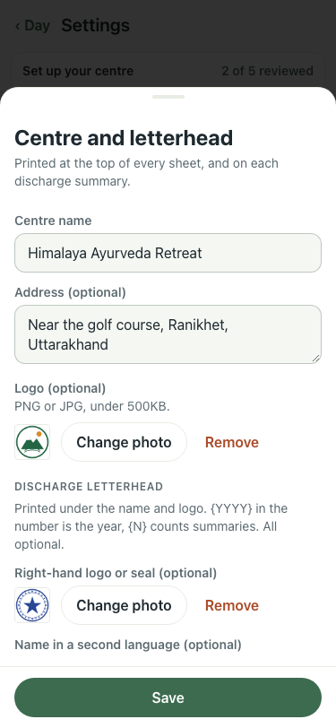

# UAT 2026-10-09-609-before

Base http://localhost:8140, 375x812. Written by scripts/uat.mjs.

| # | Step | Result | Read off the page | Shot |
|---|---|---|---|---|
| 01 | Settings has a currency symbol; set to $, the accommodation picker reads "$1,600 a day", not "Rs" | FAIL | TimeoutError: locator.inputValue: Timeout 30000ms exceeded. Call log:   - waiting for getByRole('dialog').last().getByLabel('Currency symbol') |  |
