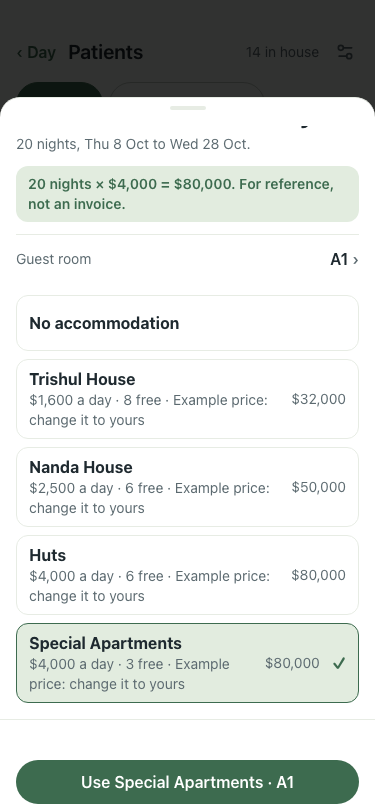

# UAT 2026-10-09-609

Base http://localhost:8164, 375x812. Written by scripts/uat.mjs.

| # | Step | Result | Read off the page | Shot |
|---|---|---|---|---|
| 01 | Settings has a currency symbol; set to $, the accommodation picker reads "$1,600 a day", not "Rs" | pass | field "$" · $1,600 a day · Rs left: false |  |
