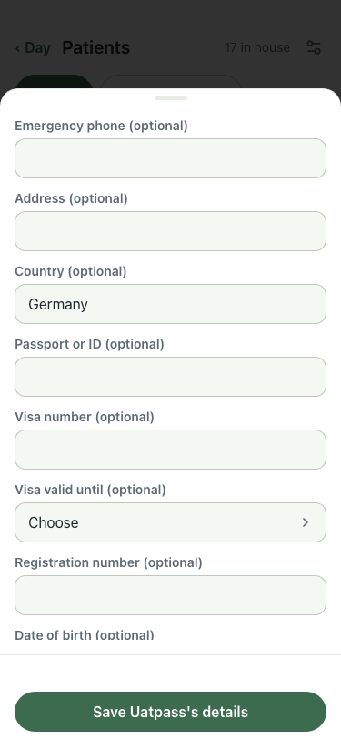

# UAT 2026-10-09-610-before

Base http://localhost:8140, 375x812. Written by scripts/uat.mjs.

| # | Step | Result | Read off the page | Shot |
|---|---|---|---|---|
| 01 | Details shows the kept photo just above "Passport or ID"; a patient with none shows no photo and no spinner | FAIL | with photo: 0 image, -px above the field · without: 0 image, 0 spinner |  |
