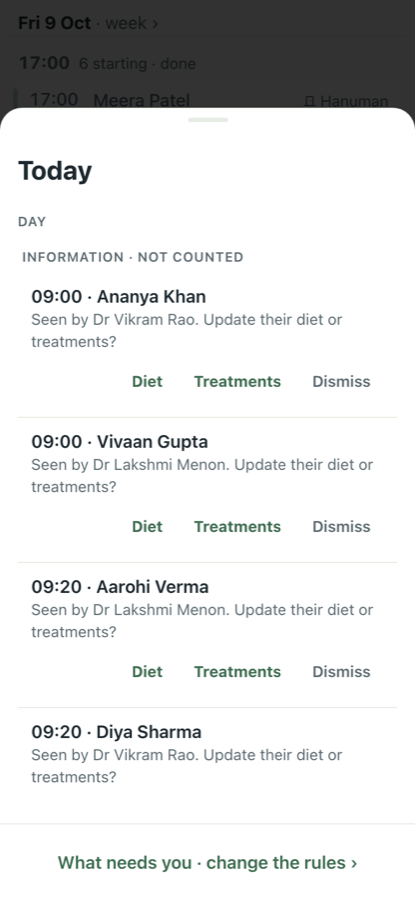
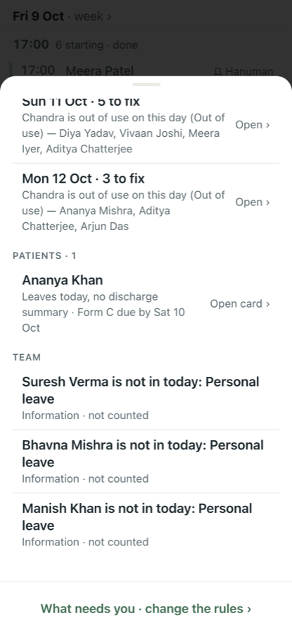
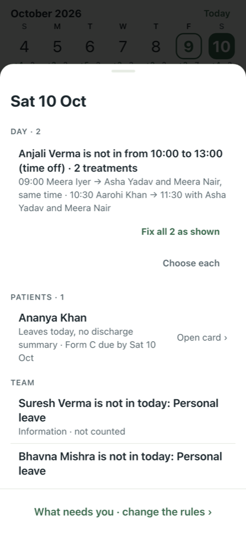
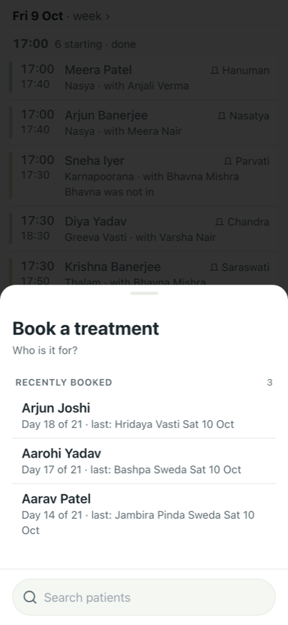
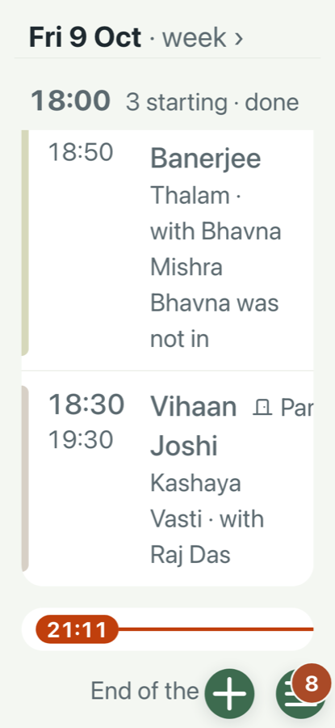
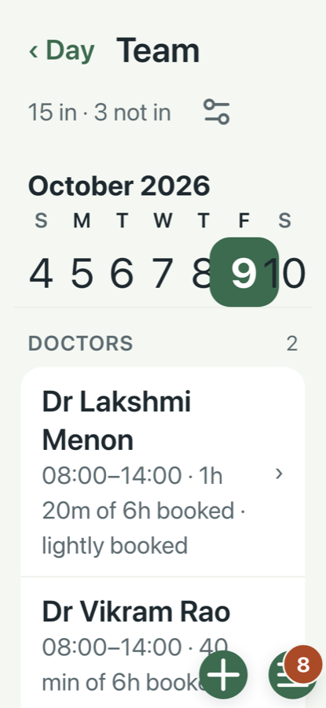
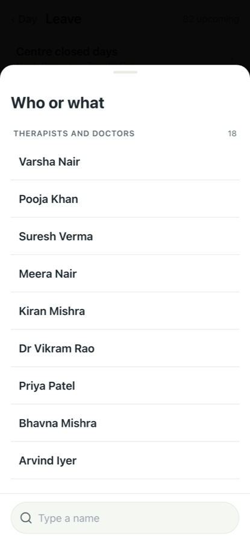
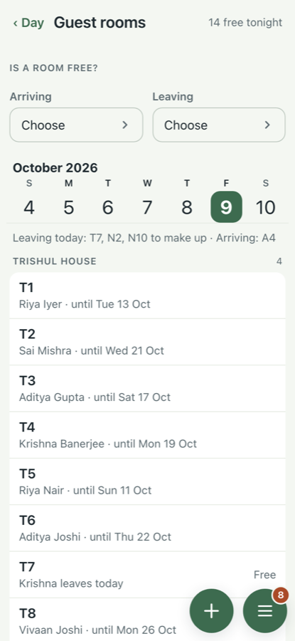
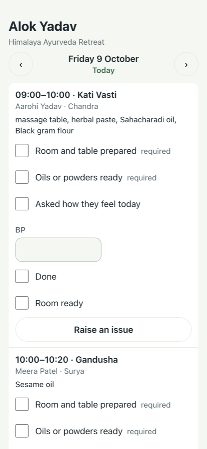
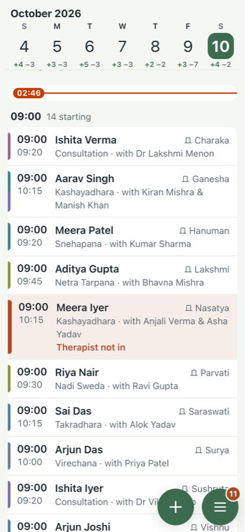

# Full walk, 9 Oct 2026

All eight screen groups at 375×812, as a receptionist on day 3 (admin) and against DESIGN.md (designer). Seeded centre at 21:00 India time (after closing), plus: a therapist off tomorrow 10:00–13:00, a room out Sat–Mon, text at 200%, the centre moved to Sydney (Sat 02:46), the four private links, and tomorrow's five printed sheets read as text. A brand-new centre was not re-walked: the 5 and 8 Oct walks covered it.

## What to fix, worst first

| Issue | Group | What | Lens |
|---|---|---|---|
| #659 | Rooms, Printed sheets | "Mark out of use, move what is booked" moves nothing; the sheet prints treatments in a closed room | admin |
| #660 | Printed sheets, Guest rooms | Shared room prints one leaving date for every guest | admin |
| #661 | Day, What needs you | What counts is listed under six grey rows | admin |
| #662 | Day, Leave, Team, Private links | After closing, sheets disagree on today or tomorrow | admin |
| #663 | What needs you | Sheet headed "Sat 10 Oct" lists today's items | admin |
| #664 | Patients | Form C "overdue" on the day it is due | admin |
| #665 | Day, Team | Cut text at 200%; the walk's check misses it | designer |

Wording and spacing went into #633–#638 and #640 as checkboxes. #639 got none: its problems are #659 and #660.

## Groups

| Group | Admin | Designer |
|---|---|---|
| Day (#633) | Finds the day fast; problems hidden under information (#661) | First names only; "Therapist not in" too blunt; cut at 200% |
| Patients (#634) | Fine | "1 day" unexplained |
| Team and Rooms (#635) | Room out for days broken (#659); "today" actions at night (#662) | Doctors' line says "booked" twice; week strip overlaps at 200% |
| Leave (#636) | Part-day leave plans the day well in one pass | Who list unsorted |
| Settings, What needs you (#637) | Wrong day under a dated heading (#663) | Two fix buttons on two lines |
| Printed sheets (#639) | Closed room printed as normal; shared-room dates wrong (#659, #660) | Clean |
| Private links (#640) | Guest link stays on a finished day at night (#662) | Therapist link very long |
| Guest rooms (#638) | Arrivals without a room not flagged (asked the maintainer) | Bare counts under each house |

## Screens

 
 
 
 
 
