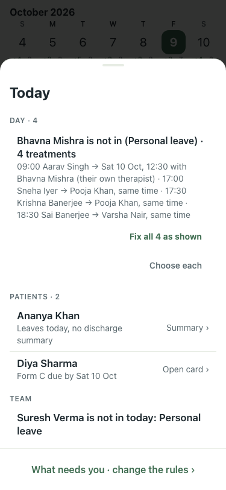
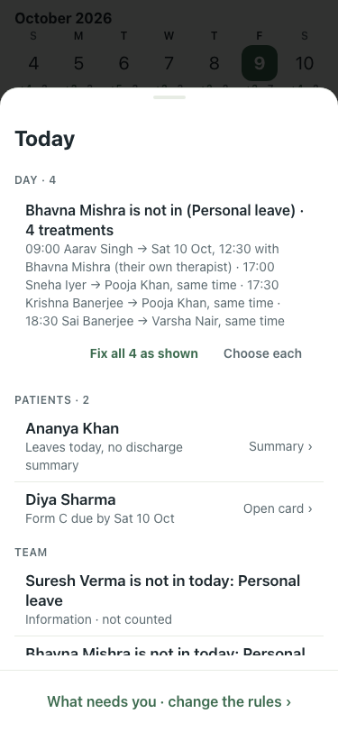

# Polish: What needs you (#637), 9 Oct

| Item | Before | After |
|---|---|---|
| "Fix all 4 as shown" and "Choose each" on two lines |  |  one row |

200% text: `*-200.png` (the buttons wrap when they do not fit).
