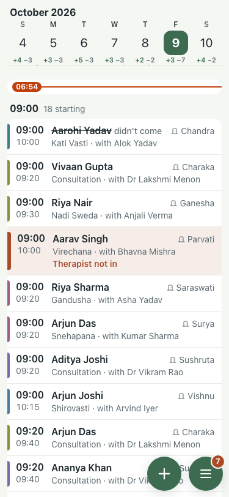
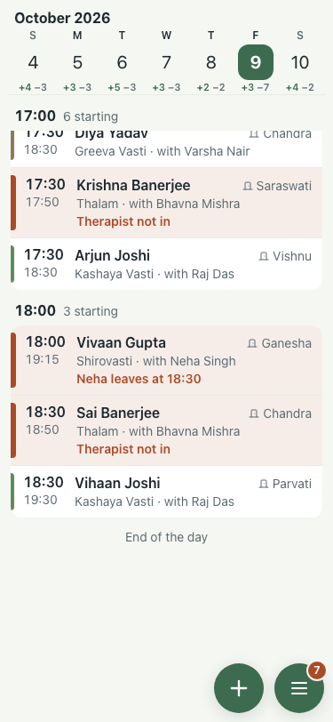

# Polish: Day (#633), 9 Oct

Throwaway stack, demo seed, centre clock set to Honolulu so the day was still running.

| Item | Before | After |
|---|---|---|
| Arrivals by first name only |  "Arriving · Diya, Ananya, Aarohi" |  "Arriving · Diya S., Ananya K., Aarohi V." |
| Part-day leave said "Therapist not in" |  |  "Neha leaves at 18:30" |

200% text: `*-200.png`. The before part-day shot shows the seeded whole-day leave, which still reads "Therapist not in".
