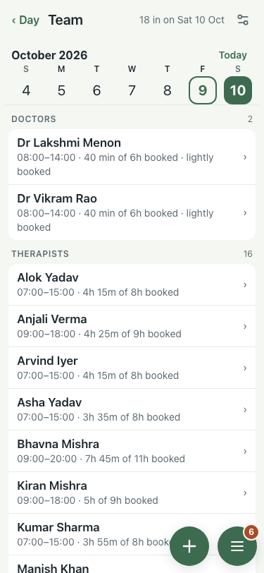
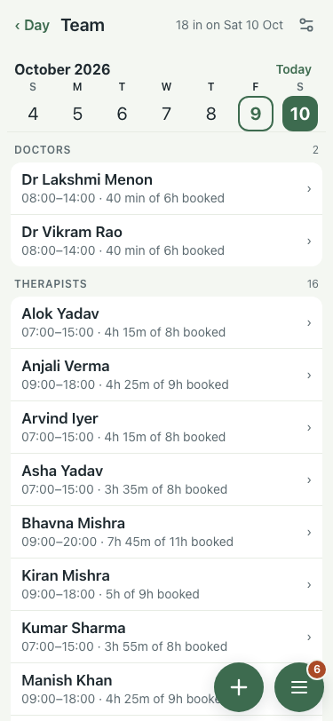

# Polish: Team and Rooms (#635), 9 Oct

| Item | Before | After |
|---|---|---|
| "40 min of 6h booked · lightly booked" said it twice |  |  "40 min of 6h booked" |

200% text: `*-200.png`. "nearly full" is kept: a warning, not a repeat.
